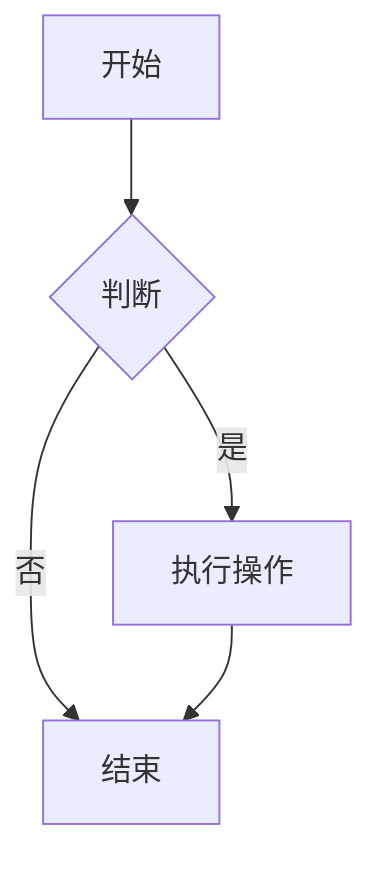
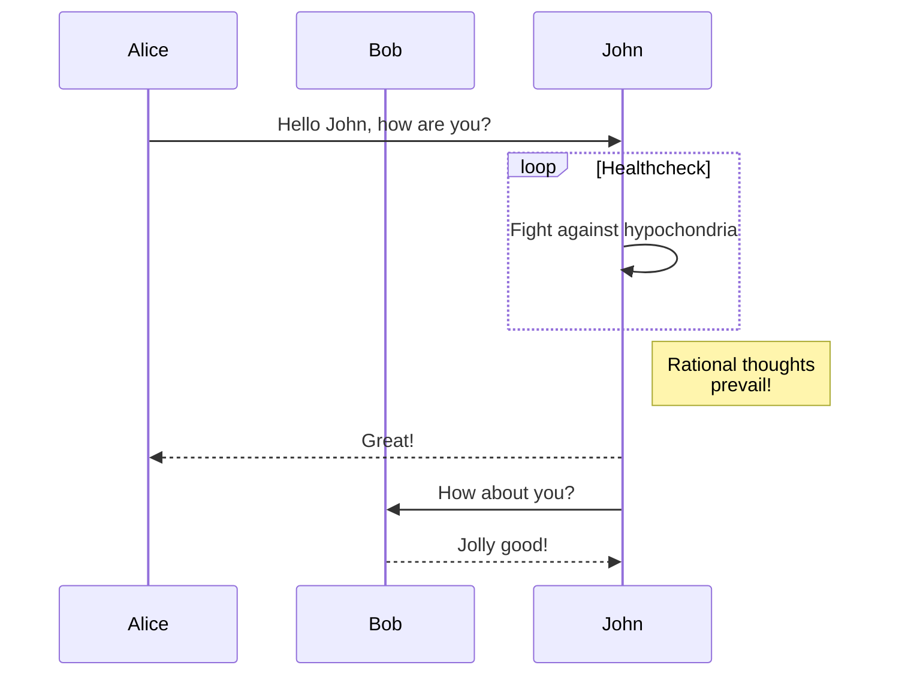
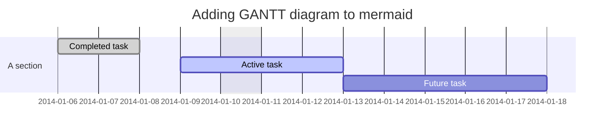
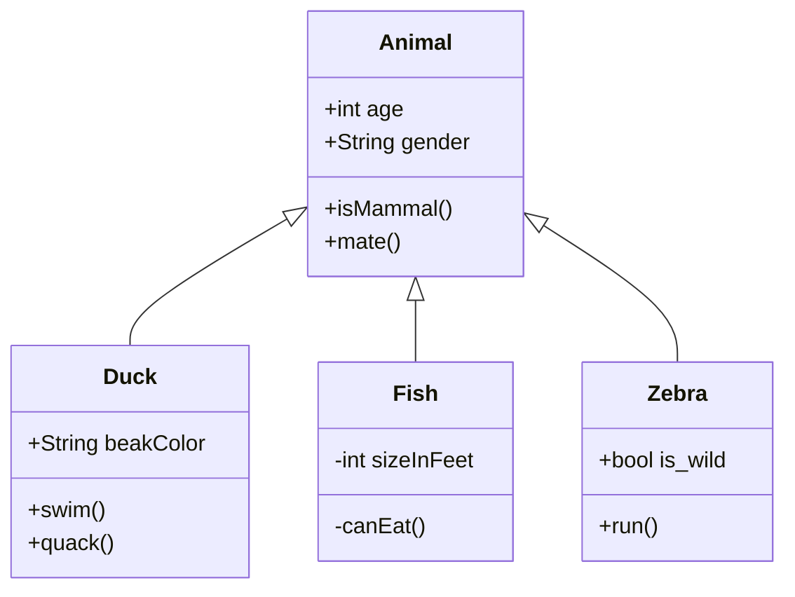

# Markdown 转 PDF 测试报告

## 1. 基础格式测试
这是一段普通文本，用于测试字体渲染。
**加粗文本**，*斜体文本*，`行内代码`。

### 代码块测试
```javascript
function hello() {
  console.log("Hello World");
}
```

## 2. Mermaid 图表测试

### 2.1 流程图 (Flowchart)


### 2.2 时序图 (Sequence Diagram)


### 2.3 甘特图 (Gantt)


### 2.4 类图 (Class Diagram)

