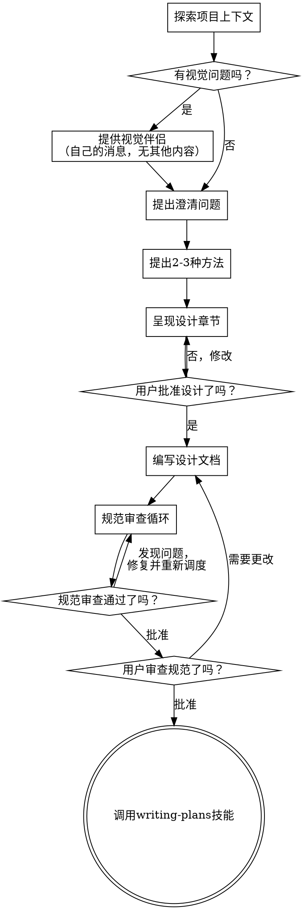

# 将想法 brainstorming 成设计

通过自然协作对话帮助将想法转化为完整的设计和规范。

首先了解当前项目上下文，然后一次一个问题地提问以完善想法。了解您要构建的内容后，呈现设计并获得用户批准。

<硬性门槛>
在呈现设计并获得用户批准之前，不得调用任何实现技能、编写任何代码、搭建任何项目或采取任何实现行动。这适用于每个项目，无论其 perceived 简单性如何。
</硬性门槛>

## 反模式："这太简单了，不需要设计"

每个项目都会经历这个过程。待办事项列表、单一功能的工具、配置更改——都是如此。"简单"项目是未经检验的假设导致最多浪费工作的地方。设计可以很短（对于真正简单的项目几句话），但您必须呈现并获得批准。

## 清单

您必须为以下每个项目创建任务并按顺序完成：

1. **探索项目上下文** — 检查文件、文档、最近的提交
2. **提供视觉伴侣**（如果主题涉及视觉问题）—— 这是它自己的消息，不要与澄清问题结合。请参阅下面的视觉伴侣部分。
3. **提出澄清问题** — 一次一个，理解目的/约束/成功标准
4. **提出2-3种方法** — 包含权衡和您的建议
5. **呈现设计** — 按复杂性缩放的章节，在每个章节后获得用户批准
6. **编写设计文档** — 保存到 `docs/superpowers/specs/YYYY-MM-DD-<topic>-design.md` 并提交
7. **规范审查循环** — 使用精心制作的审查上下文（绝不是您的会话历史）调度 spec-document-reviewer 子代理；修复问题并重新调度直到批准（最多3次迭代，然后提交给人类）
8. **用户审查书面规范** — 在继续之前请用户审查规范文件
9. **过渡到实现** — 调用 writing-plans 技能创建实现计划

## 流程图

**最终状态是调用 writing-plans。** 在 brainstorming 之后不要调用 frontend-design、mcp-builder 或任何其他实现技能。brainstorming 之后唯一可以调用的技能是 writing-plans。

## 过程

**理解想法：**

- 首先查看当前项目状态（文件、文档、最近的提交）
- 在提问详细问题之前，评估范围：如果请求描述了多个独立子系统（例如，"构建一个包含聊天、文件存储、计费和分析的平台"），立即标记这一点。先不要花时间完善一个需要先分解的项目的细节。
- 如果项目太大无法单个规范处理，帮助用户分解为子项目：独立的 pieces 是什么？它们如何关联？应该按什么顺序构建？然后通过正常的设计流程 brainstorming 第一个子项目。每个子项目都有自己的规范 → 计划 → 实现周期。
- 对于适当范围的项目，一次提一个问题以完善想法
- 尽可能使用多项选择问题，但开放性问题也可以
- 每条消息只有一个问题——如果一个主题需要更多探索，将其分成多个问题
- 专注于理解：目的、约束、成功标准

**探索方法：**

- 提出2-3种不同的方法并说明权衡
- 用对话方式呈现选项，包含您的建议和推理
- 首先提出您推荐的选择并解释原因

**呈现设计：**

- 一旦您相信理解了要构建的内容，就呈现设计
- 将每个部分按其复杂性缩放：如果 straightforward，几句话；如果细微，最多200-300词
- 在每个部分之后询问是否到目前为止看起来正确
- 涵盖：架构、组件、数据流、错误处理、测试
- 如果有什么不合理的地方，准备好回去澄清

**为隔离和清晰度设计：**

- 将系统分解为更小的单元，每个单元有一个清晰的目的，通过定义良好的接口通信，可以独立理解和测试
- 对于每个单元，您应该能够回答：它是做什么的？你怎么使用它？它依赖什么？
- 有人可以在不阅读其内部实现的情况下理解一个单元是做什么的吗？您可以更改内部实现而不破坏使用者吗？如果不能，边界需要改进。
- 更小、边界良好的单元也更易于您使用——您可以更好地推理一次可以掌握的代码，当文件专注于单一职责时，您的编辑更可靠。当一个文件变得很大时，这通常是它做得太多的信号。

**在现有代码库中工作：**

- 在提出更改之前探索当前结构。遵循现有模式。
- 如果现有代码有问题影响工作（例如，一个变得太大的文件、边界不清、职责纠缠），将针对性的改进作为设计的一部分包含在内——就像一个好的开发人员改进他们正在处理的代码一样。
- 不要提出无关的重构。专注于为当前目标服务的内容。

## 设计之后

**文档：**

- 将验证过的设计（规范）写入 `docs/superpowers/specs/YYYY-MM-DD-<topic>-design.md`
  - （用户对规范位置的偏好优先于此默认）
- 如果有 elements-of-style:writing-clearly-and-concisely 技能，请使用它
- 将设计文档提交到 git

**规范审查循环：**
编写规范文档后：

1. 调度 spec-document-reviewer 子代理（参见 spec-document-reviewer-prompt.md）
2. 如发现问题：修复、重新调度、重复直到批准
3. 如果循环超过3次迭代，提交给人类寻求指导

**用户审查门槛：**
规范审查循环通过后，请在继续之前让用户审查书面规范：

> "规范已编写并提交到 `<path>`。请查看它，告诉我们是否要在开始编写实现计划之前做任何更改。"

等待用户响应。如果他们请求更改，进行更改并重新运行规范审查循环。只有在用户批准后才能继续。

**实现：**

- 调用 writing-plans 技能创建详细的实现计划
- 不要调用任何其他技能。writing-plans 是下一步。

## 关键原则

- **一次一个问题** - 不要用多个问题淹没用户
- **首选多项选择** - 尽可能比开放性问题更容易回答
- **YAGNI 严格** - 从所有设计中删除不必要的功能
- **探索替代方案** - 在确定之前始终提出2-3种方法
- **增量验证** - 呈现设计，获得批准后再继续
- **保持灵活** - 当事情不合理时回去澄清

## 视觉伴侣

一个基于浏览器的伴侣，用于在 brainstorming 期间显示模型图、图表和视觉选项。作为工具提供——不是一种模式。接受伴侣意味着它可用于受益于视觉处理的问题；这并不意味着每个问题都要通过浏览器。

**提供伴侣：** 当您预期即将到来的问题会涉及视觉内容（模型图、布局、图表）时，提供一次以获得同意：
> "我们正在做一些工作，如果能在网页上向您展示可能会更容易解释。我可以随着进度整理模型图、图表、比较和其他视觉内容。这个功能还是新的，可能比较消耗 token。想试试吗？（需要打开本地URL）"

**这个报价必须是它自己的消息。** 不要将其与澄清问题、上下文摘要或任何其他内容结合。消息应仅包含上述报价，不要有其他内容。等待用户响应后再继续。如果他们拒绝，继续纯文本 brainstorming。

**每个问题的决策：** 即使用户接受了，也要为每个问题决定是使用浏览器还是终端。测试是：**用户通过看到它比阅读它更好地理解吗？**

- **使用浏览器** 用于视觉内容——模型图、线框、布局比较、架构图、并排视觉设计
- **使用终端** 用于文本内容——需求问题、概念选择、权衡列表、A/B/C/D 文本选项、范围决策

关于 UI 主题的问题不一定自动是视觉问题。"在这个上下文中个性是什么意思？"是一个概念问题——使用终端。"哪个向导布局更好？"是一个视觉问题——使用浏览器。

如果他们同意伴侣，请先阅读详细指南：
`skills/brainstorming/visual-companion.md`
